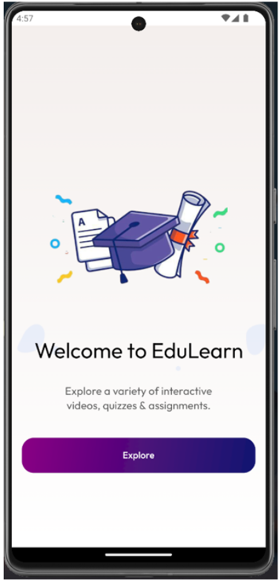
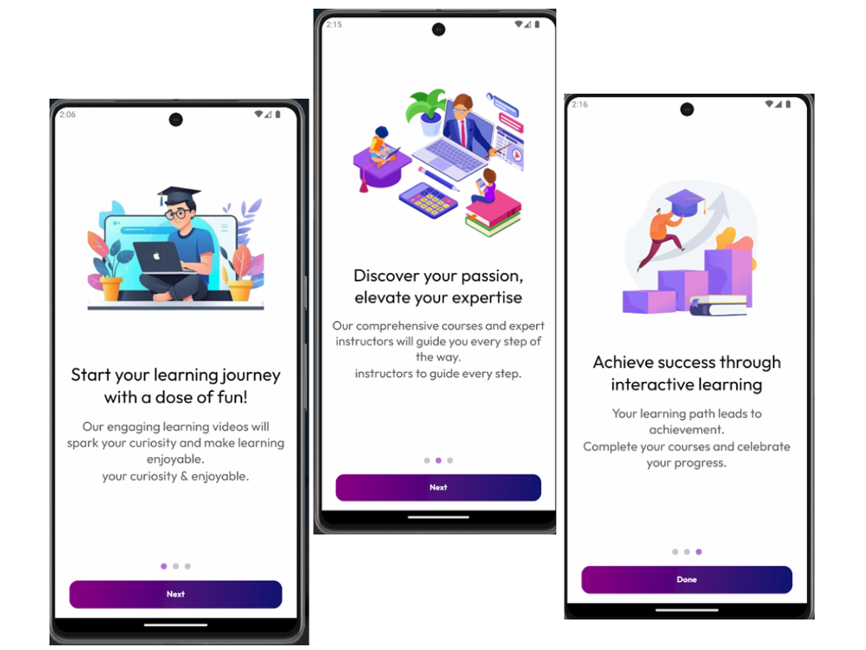
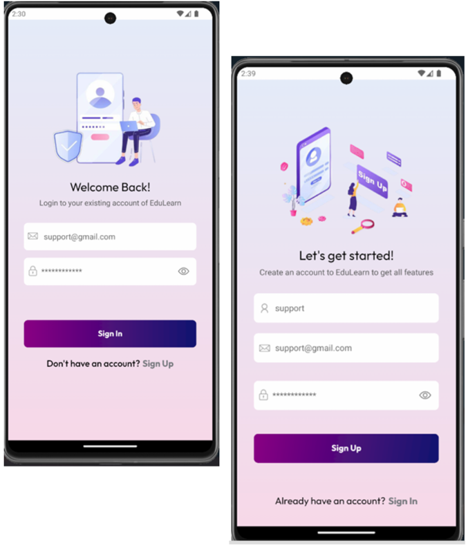
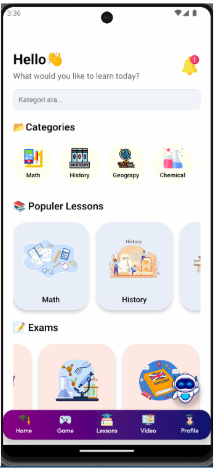
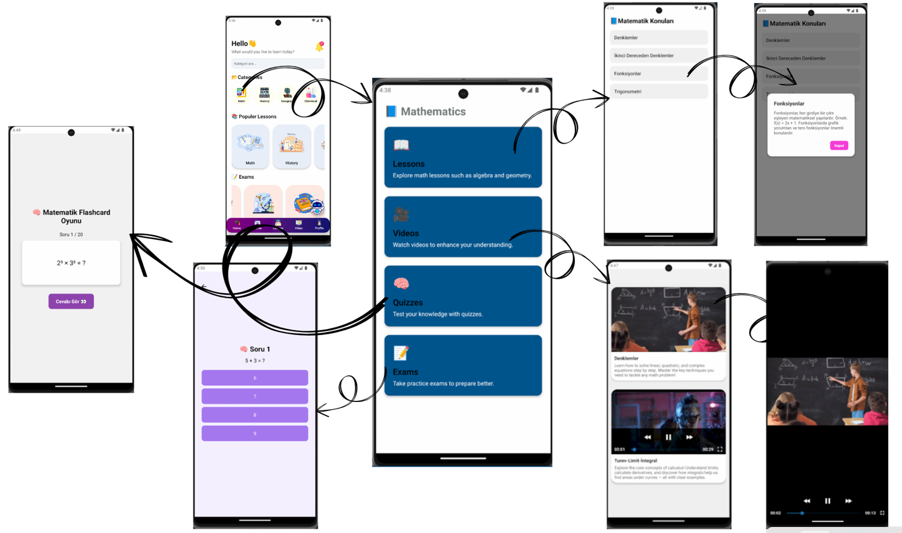
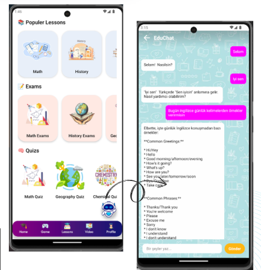
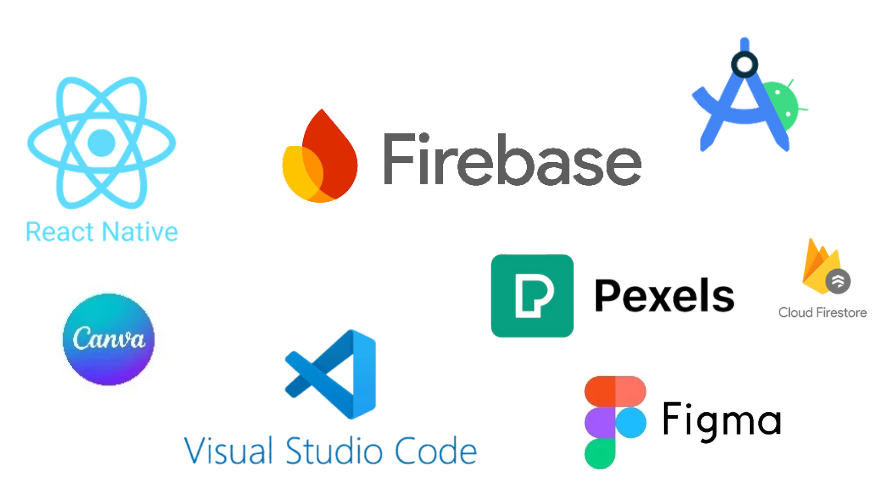

# 📱 EduLearn

**EduLearn** is an advanced mobile learning platform designed to provide students with an engaging, interactive, and personalized educational experience. The application combines multimedia content, self-assessment tools, and artificial intelligence to support various learning styles and academic needs.

Leveraging the cross-platform power of React Native, EduLearn delivers a seamless user experience on both Android and iOS devices. It integrates Firebase services for secure authentication, real-time database management, and cloud storage, ensuring data integrity and scalability. Furthermore, the app incorporates Google's Gemini API to offer a cutting-edge AI chatbot that allows users to ask academic questions, receive intelligent feedback, and interact with educational content in a conversational format.
EduLearn is not just a content delivery platform—it is a smart learning assistant. With categorized video lessons, dynamically generated quizzes, progress-tracking dashboards, and AI-powered recommendations, EduLearn is built to foster independent learning, reinforce classroom knowledge, and make studying more accessible and enjoyable.


---

## 🧠 Table of Contents

- [📌 About the Project](#-about-the-project)
- [🚀 Features](#-features)
- [🖼️ Application Screenshots](#-application-screenshots)
- [⚙️ Installation & Usage](#-installation--usage)
- [🔐 Firebase Setup](#-firebase-setup)
- [🤖 AI Chatbot Integration](#-ai-chatbot-integration)
- [📊 Progress Tracking & Analytics](#-progress-tracking--analytics)
- [🧪 Testing Scenarios](#-testing-scenarios)
- [🧰 Technologies Used](#-technologies-used)
- [🙌 Contributing](#-contributing)
- [📬 Contact](#-contact)
- [📄 License](#-license)

---

## 📌 About the Project

**EduLearn** allows students to:

- 📺 Access categorized video lessons,
- 📝 Reinforce knowledge with quizzes and exams,
- 💬 Interact with an AI chatbot powered by Google Gemini API for question-answering and learning assistance.

The application is designed to facilitate personalized learning and enable students to monitor their progress effectively.

---

## 🚀 Features

| Feature                   | Description |
|---------------------------|-------------|
| 🔐 User Authentication    | Secure login/signup using Firebase Authentication |
| 🎞️ Video Lessons          | Organized by subject topics for easy navigation |
| 🧠 Quizzes & Exams        | Auto-scoring system for real-time feedback |
| 💬 AI Chatbot             | Interactive Q&A with Google Gemini API integration |
| 📊 Analytics & Reports    | Personalized success charts and quiz history |
| ☁️ Real-time Database     | Firestore-powered live content and data synchronization |

---

## 🖼️ Application Screenshots

> Add your app screenshots to the `screenshots/` folder and update the file names accordingly.

| Splash Screen | Onboarding Screens | Login/SignUp Screens |
|-------------|--------------|-------------|
|  |  |  |

| Home Screen | Category Screen | EduChat |
|------------|--------------|-----------|
|  |  |  

|Technologies Used    |
|---------------------|
|  |

---

## ⚙️ Installation & Usage

### 🔧 Development Environment

- Node.js ≥ 16
- npm ≥ 8
- Expo CLI
- Firebase Console account
- Google Gemini API key

### 🛠️ Installation Steps

1. **Clone the repository**
```bash
git clone https://github.com/your-username/edulearn.git
cd edulearn
